# 👋 Hi, I'm Miguel or simply Mike

### 💻 Backend Developer | 📊 Data Analyst | 🚀 Systems & Computing Engineer

> **From Zero to Hero.**

I'm a **Systems and Computing Engineer** passionate about software development, data analysis, artificial intelligence and cloud technologies.

I enjoy transforming ideas and real-world problems into practical technological solutions, combining **software engineering, data and AI** to build useful and scalable projects.

📍 **Sogamoso, Colombia 🇨🇴**

---

## 🧑‍💻 About Me

- 🎓 **Systems and Computing Engineer**
- 💻 **Backend Developer**
- 📊 **Data Analyst**
- 🤖 Interested in **Artificial Intelligence & Machine Learning**
- ☁️ Exploring **Cloud & Data Engineering**
- 🔎 Interested in solving real-world problems through technology
- 🚀 Building personal and freelance projects
- 🧩 Passionate about problem solving and continuous learning

---

## 🛠️ Technologies & Tools

### 👨‍💻 Programming Languages

  

### 🌐 Backend & Web Development

  

### 📊 Data & Analytics

  

**Data & Machine Learning**

`Pandas` · `NumPy` · `Scikit-learn` · `Matplotlib` · `Plotly` · `SQL` · `Machine Learning`

### ☁️ Cloud & Data Engineering

  

`AWS S3` · `AWS Lambda` · `AWS Glue` · `Amazon Athena` · `IAM` · `Lake Formation` · `DataZone` · `QuickSight`

### 🔧 Tools & Platforms

  

`Git` · `GitHub` · `VS Code` · `IntelliJ IDEA` · `Docker` · `Jupyter`

---

# 🚀 Featured Projects

## 🏥 HealthLife AI Auditor

**HealthLife AI Auditor** is a digital medical auditing solution designed to support medical auditing processes through artificial intelligence, machine learning and automated analysis.

**Technologies**

`Python` · `Machine Learning` · `XGBoost` · `NLP` · `Sentence Transformers` · `AI`

🔗 [View project](https://github.com/MikeStorm-dev/healthlife-ai-auditor)

---

## 📊 Predictive Sales & Inventory Analytics

A predictive analytics project focused on understanding **sales behavior, seasonality, inventory patterns and stockout risks** using large-scale datasets.

The project combines data analysis, machine learning and interactive visualization to support data-driven decision making.

**Technologies**

`Python` · `Pandas` · `Scikit-learn` · `XGBoost` · `Random Forest` · `Plotly` · `SQL`

---

## ☁️ Cloud & Data Projects

Projects focused on building data pipelines, analytics solutions and cloud architectures using AWS services.

**Technologies**

`AWS` · `S3` · `Glue` · `Lambda` · `Athena` · `DataZone` · `QuickSight`

---

# 📈 GitHub Statistics

  

  

---

# 🔥 GitHub Streak

  

---

# 🏆 GitHub Trophies

  

---

# 👥 GitHub Community

---

# 📊 Development Focus

| Area | Focus |
|---|---|
| 💻 Backend Development | APIs, architectures & backend systems |
| 📊 Data Analysis | Data exploration, visualization & insights |
| 🐍 Python | Data, automation & AI |
| ☕ Java | Backend development & software engineering |
| 🤖 Machine Learning | Predictive models & intelligent solutions |
| ☁️ AWS | Cloud & data engineering |
| 🌐 Web Development | Full-stack applications |

---

# 📚 Currently Learning

- 🤖 Artificial Intelligence & Generative AI
- 📊 Advanced Data Analytics
- ☁️ AWS & Cloud Architecture
- 🧠 Machine Learning
- 🔗 Backend Architecture & APIs
- 🐳 Docker & Deployment
- ⚙️ Software Engineering Best Practices

---

# 📫 Let's Connect

---

# 🌐 Personal Website

> 🚧 **Coming soon**

<!--

  

-->

---

# 🐍 Contribution Snake

  

---

# 💡 Philosophy

> **"From Zero to Hero."**

I believe every project is an opportunity to learn something new, solve a problem and turn an idea into something real.

---

  <b>Thanks for visiting my profile! 🚀</b>

  ⭐ Feel free to explore my repositories and connect with me!

